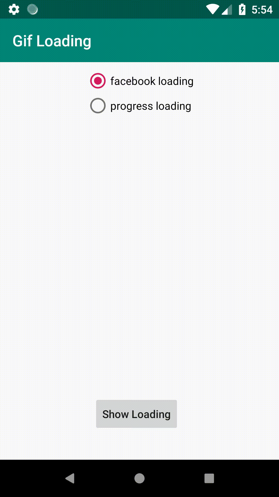

# GifLoading
Gif images loading indicator

# How to use
1- Add it in your root build.gradle at the end of repositories:

allprojects {
		repositories {
			maven { url 'https://jitpack.io' }
		}
    
2- Add the dependency
dependencies {
      	        implementation 'com.github.Mohammed-Alaa:GifLoading:1.0.0'
		}    
  
  
  
